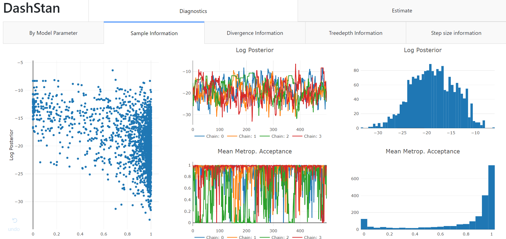
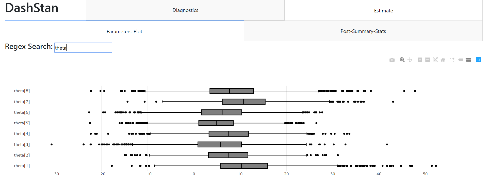
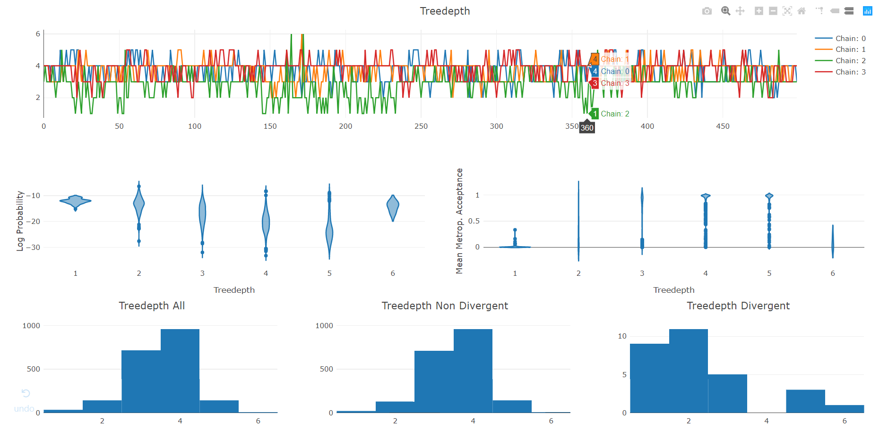

DashStan
========

**Dashstan** is a dashboard that helps you analyze potential problems from
a Stan made No-U-Turn MCMC.

**Built with:**

- Plotly_ and Dash
- Pandas_

.. _Plotly: https://plot.ly/
.. _Pandas: https://pandas.pydata.org/

**Screen Shots**

**Demo**

>>> from dashstan import DashStanExample
>>> DashStanExample()